# 🔧 Advanced Technical Architecture Diagrams

**Version:** 1.0.0
**Date:** January 2025
**Companion to:** CONFLUENCE_DOCUMENTATION.md

---

## 📋 Table of Contents

1. [Backend Architecture Deep Dive](#backend-architecture-deep-dive)
2. [Frontend Architecture](#frontend-architecture)
3. [Database Architecture](#database-architecture)
4. [AI Services Architecture](#ai-services-architecture)
5. [WebSocket Communication](#websocket-communication)
6. [Request/Response Flow](#requestresponse-flow)
7. [Error Handling Architecture](#error-handling-architecture)
8. [Caching Strategy](#caching-strategy)
9. [Security Implementation](#security-implementation)
10. [Deployment Architecture](#deployment-architecture)

---

## 🖥️ Backend Architecture Deep Dive

### Layered Architecture Overview

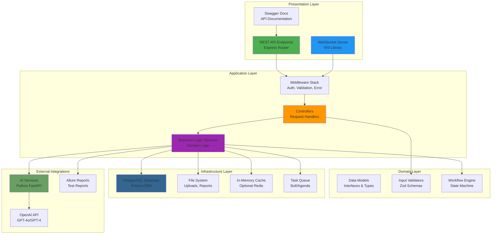

### Middleware Pipeline

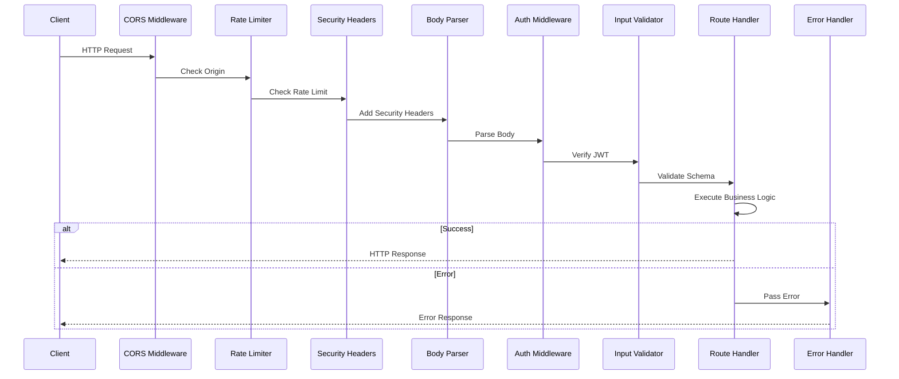

### Controller-Service-Repository Pattern

```mermaid
graph LR
    subgraph "Controller Layer"
        AuthController["Auth Controller<br/>/api/auth/*"]
        ScriptController["Script Controller<br/>/api/scripts/*"]
        TestRunController["Test Run Controller<br/>/api/test-runs/*"]
        AIController["AI Controller<br/>/api/ai-*"]
    end

    subgraph "Service Layer"
        AuthService["Auth Service<br/>User Management"]
        ScriptService["Script Service<br/>CRUD Operations"]
        ExecutionService["Execution Service<br/>Test Runner"]
        AIService["AI Service<br/>AI Integration"]
        TestDataService["Test Data Service<br/>Data Generation"]
    end

    subgraph "Repository Layer"
        UserRepository["User Repository<br/>Prisma Queries"]
        ScriptRepository["Script Repository<br/>Prisma Queries"]
        TestRunRepository["Test Run Repository<br/>Prisma Queries"]
    end

    AuthController --> AuthService
    ScriptController --> ScriptService
    TestRunController --> ExecutionService
    AIController --> AIService

    AuthService --> UserRepository
    ScriptService --> ScriptRepository
    ExecutionService --> ScriptRepository
    ExecutionService --> TestRunRepository
    AIService --> TestDataService

    UserRepository --> DB[(("PostgreSQL"))]
    ScriptRepository --> DB
    TestRunRepository --> DB

    style AuthController fill:#E91E63
    style ScriptController fill:#9C27B0
    style TestRunController fill:#2196F3
    style AIController fill:#4CAF50
```

---

## 🎨 Frontend Architecture

### React Component Hierarchy

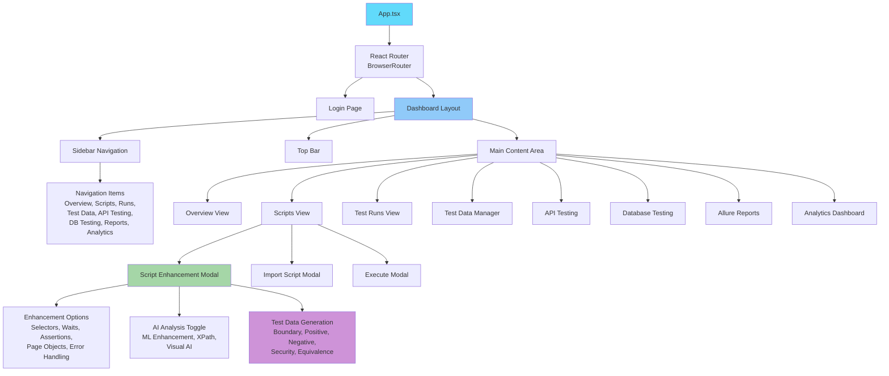

### State Management Architecture

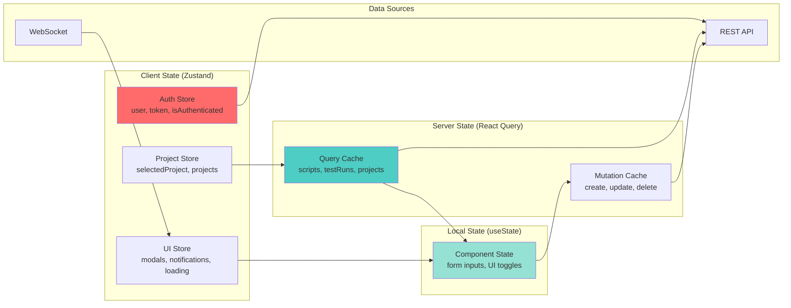

### Data Flow in Frontend

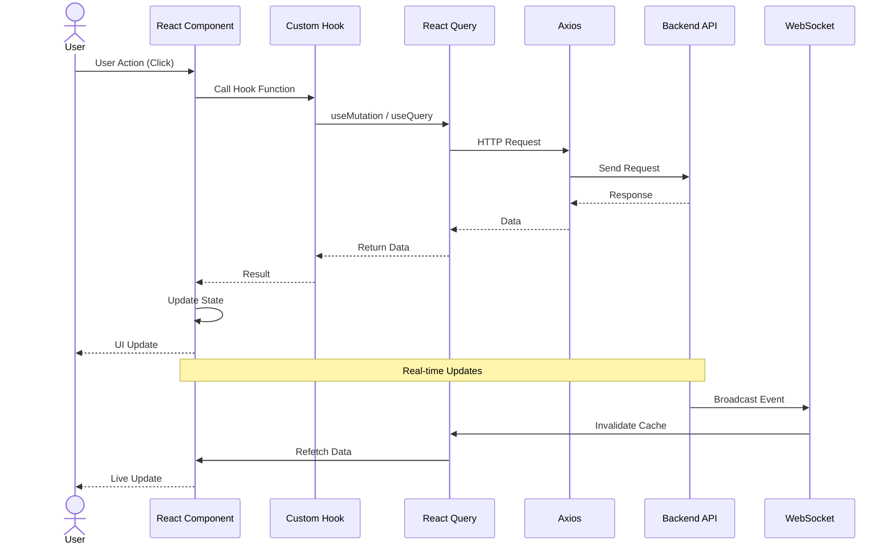

---

## 🗄️ Database Architecture

### PostgreSQL Schema Details

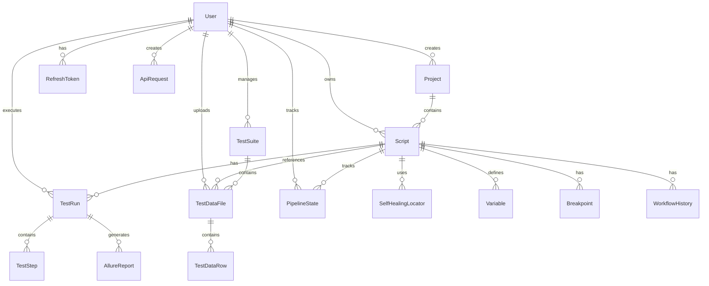

### Database Indexing Strategy

```mermaid
graph TB
    subgraph "Primary Indexes"
        PK["Primary Keys<br/>id columns on all tables"]
    end

    subgraph "Foreign Key Indexes"
        FK["Foreign Key Columns<br/>userId, scriptId, projectId,<br/>suiteId, testRunId"]
    end

    subgraph "Unique Constraints"
        UK["Unique Columns<br/>email (User),<br/>name + projectId (Script)"]
    end

    subgraph "Query Performance Indexes"
        QPI["Frequently Queried Columns<br/>status (TestRun),<br/>language (Script),<br/>createdAt (all tables)"]
    end

    subgraph "Composite Indexes"
        CI["Multi-Column Indexes<br/>userId + createdAt (TestRun),<br/>scriptId + status (TestRun)"]
    end

    subgraph "Full-Text Search"
        FTS["Full-Text Indexes<br/>name, description (Script)<br/>name (Project)"]
    end

    PK --> DB[(("PostgreSQL Database"))]
    FK --> DB
    UK --> DB
    QPI --> DB
    CI --> DB
    FTS --> DB

    style PK fill:#4CAF50
    style FK fill:#2196F3
    style UK fill:#FF9800
    style QPI fill:#9C27B0
    style CI fill:#E91E63
    style FTS fill:#00BCD4
```

### Query Optimization Strategy

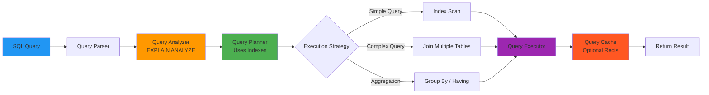

---

## 🤖 AI Services Architecture

### AI Analysis Service (Python FastAPI)

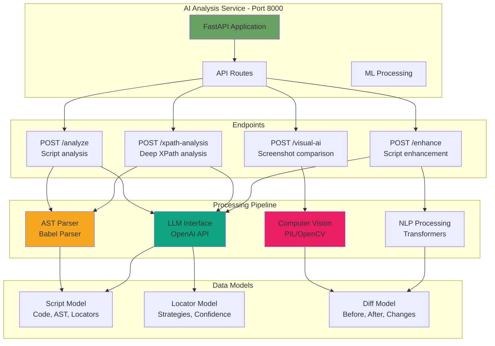

### Genie Test Data Service

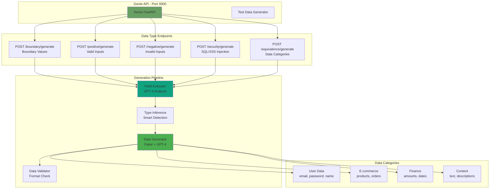

### OpenAI Integration Flow

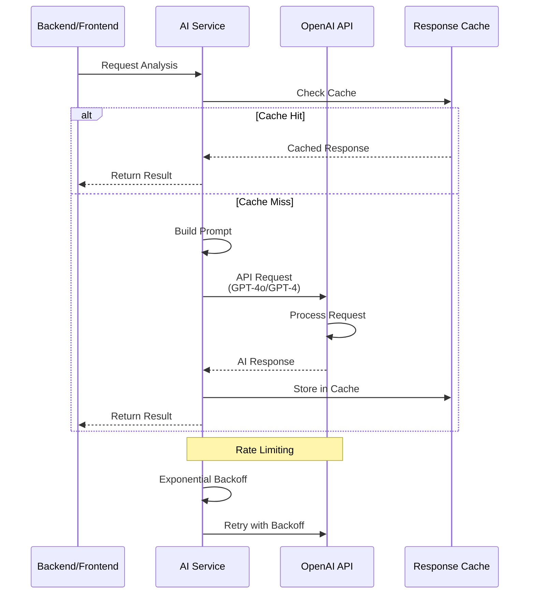

---

## 🔌 WebSocket Communication

### WebSocket Server Architecture

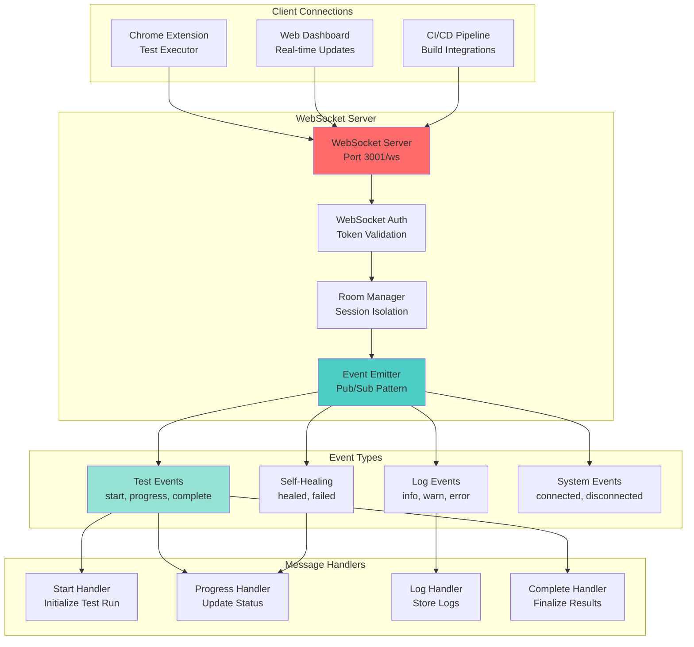

### WebSocket Message Flow

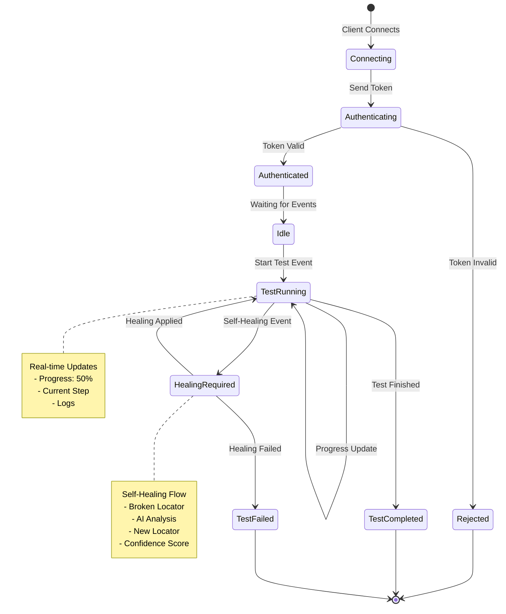

---

## 📨 Request/Response Flow

### Complete Request Lifecycle

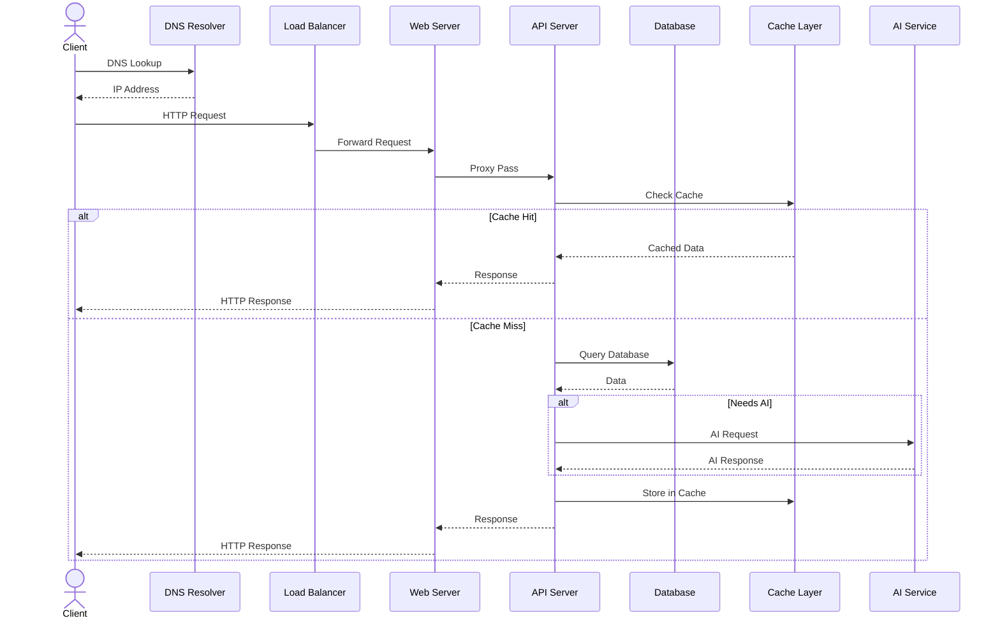

### API Response Format Standards

```mermaid
graph LR
    subgraph "Success Response"
        Success{"success": true}
        Data["data: {...}"]
        Message["message: 'Operation successful'"]
        Success --> Data
        Success --> Message
    end

    subgraph "Error Response"
        Error{"success": false}
        ErrorCode["error: 'ERROR_CODE'"]
        ErrorMsg["message: 'Human readable error'"]
        Details["details: {...}<br/>Stack trace, validation errors"]
        Error --> ErrorCode
        Error --> ErrorMsg
        Error --> Details
    end

    subgraph "Paginated Response"
        Paginated{"data: [...]}
        Meta["meta: {<br/>page: 1,<br/>limit: 10,<br/>total: 100,<br/>totalPages: 10<br/>}"]
        Paginated --> Meta
    end

    style Success fill:#4CAF50
    style Error fill:#F44336
    style Paginated fill:#2196F3
```

---

## ⚠️ Error Handling Architecture

### Error Handling Pipeline

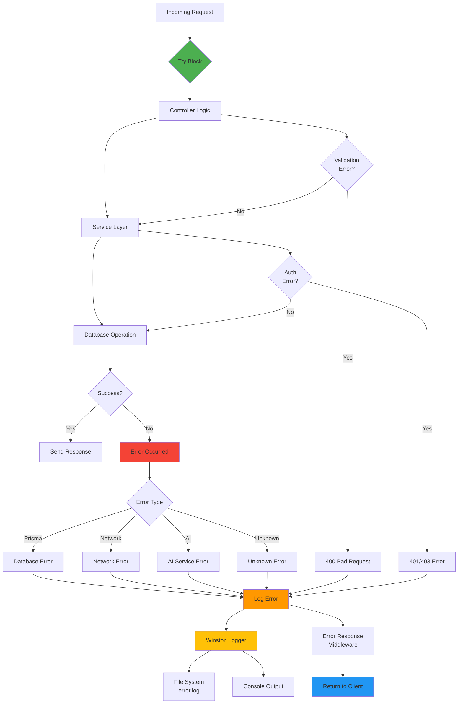

### Error Categories and Handling

```mermaid
graph TB
    subgraph "Client Errors (4xx)"
        BadRequest["400 Bad Request<br/>Invalid Input"]
        Unauthorized["401 Unauthorized<br/>Not Logged In"]
        Forbidden["403 Forbidden<br/>No Permission"]
        NotFound["404 Not Found<br/>Resource Missing"]
        Conflict["409 Conflict<br/>Duplicate Entry"]
        Validation["422 Validation Error<br/>Schema Mismatch"]
    end

    subgraph "Server Errors (5xx)"
        InternalError["500 Internal Error<br/>Unexpected Error"]
        NotAvailable["503 Service Unavailable<br/>AI Service Down"]
        Timeout["504 Gateway Timeout<br/>External API Timeout"]
    end

    subgraph "Custom Errors"
        ScriptError["Script Execution Error<br/>Test Failed"]
        HealingError["Self-Healing Error<br/>Cannot Recover"]
        DataError["Test Data Error<br/>Invalid Data"]
    end

    BadRequest --> Handler[Error Handler]
    Unauthorized --> Handler
    Forbidden --> Handler
    NotFound --> Handler
    Conflict --> Handler
    Validation --> Handler

    InternalError --> Handler
    NotAvailable --> Handler
    Timeout --> Handler

    ScriptError --> Handler
    HealingError --> Handler
    DataError --> Handler

    Handler --> Response[Standardized Response]

    style BadRequest fill:#FF9800
    style Unauthorized fill:#F44336
    style InternalError fill:#9C27B0
    style ScriptError fill:#2196F3
```

---

## 💾 Caching Strategy

### Multi-Layer Caching

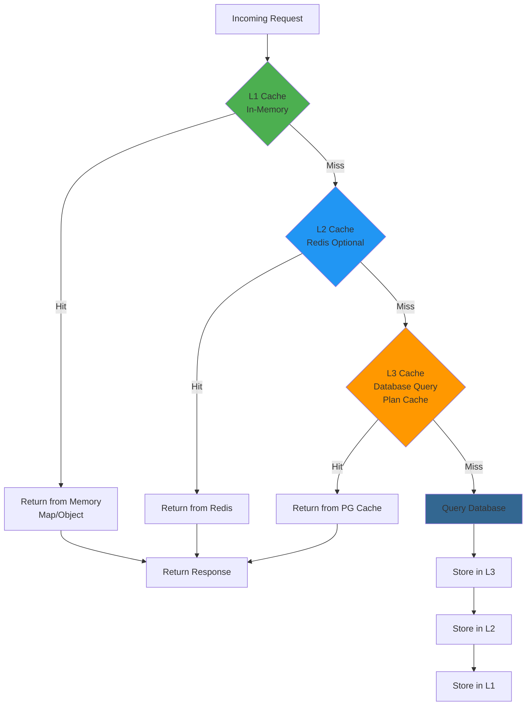

### Cache Invalidation Strategy

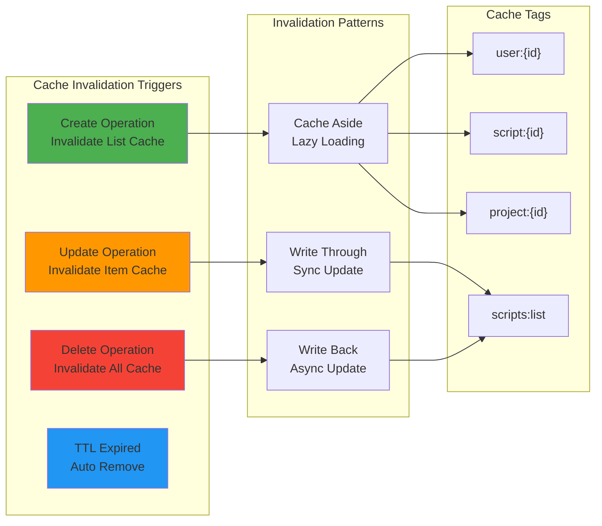

---

## 🔐 Security Implementation

### Authentication & Authorization Flow

```mermaid
sequenceDiagram
    actor User
    participant Frontend
    participant API
    participant JWT as JWT Service
    participant DB as Database
    participant RBAC as RBAC Engine

    User->>Frontend: Login Request
    Frontend->>API: POST /api/auth/login<br/>{email, password}
    API->>DB: Find User by Email
    DB-->>API: User Record

    alt User Found
        API->>API: Compare Password<br/>bcrypt.compare()
        alt Password Match
            API->>JWT: Generate Tokens
            JWT->>JWT: Sign with Secret
            JWT-->>API: Access + Refresh Tokens
            API->>DB: Update Last Login
            API-->>Frontend: Tokens + User Data
            Frontend->>Frontend: Store in localStorage
            Frontend-->>User: Redirect to Dashboard
        else Password Invalid
            API-->>Frontend: 401 Unauthorized
        end
    else User Not Found
        API-->>Frontend: 404 Not Found
    end

    Note over Frontend,RBAC: Protected Request
    Frontend->>API: Request + Authorization Header
    API->>JWT: Verify Token
    JWT-->>API: Decoded Payload
    API->>RBAC: Check Permissions
    RBAC->>RBAC: role + resource check
    RBAC-->>API: Has Access
    API-->>Frontend: Protected Resource
```

### Security Middleware Stack

```mermaid
graph TB
    Request[Incoming Request] --> MW1[Middleware 1<br/>CORS]

    MW1 --> Check1{Origin<br/>Allowed?}
    Check1 -->|No| CORS_Error[403 CORS Error]
    Check1 -->|Yes| MW2[Middleware 2<br/>Rate Limiting]

    MW2 --> Check2{Within<br/>Limits?}
    Check2 -->|No| Rate_Error[429 Too Many Requests]
    Check2 -->|Yes| MW3[Middleware 3<br/>Helmet Security]

    MW3 --> MW4[Middleware 4<br/>Body Parser]

    MW4 --> MW5[Middleware 5<br/>Request Logger]

    MW5 --> MW6[Middleware 6<br/>JWT Authentication]

    MW6 --> Check3{Token<br/>Valid?}
    Check3 -->|No| Auth_Error[401 Unauthorized]
    Check3 -->|Yes| MW7[Middleware 7<br/>Role Check]

    MW7 --> Check4{Has<br/>Permission?}
    Check4 -->|No| Forbid_Error[403 Forbidden]
    Check4 -->|Yes| MW8[Middleware 8<br/>Input Validation]

    MW8 --> Check5{Schema<br/>Valid?}
    Check5 -->|No| Valid_Error[400 Bad Request]
    Check5 -->|Yes| Controller[Route Handler]

    Controller --> Response[Send Response]

    style MW1 fill:#4CAF50
    style MW6 fill:#2196F3
    style MW7 fill:#FF9800
    style MW8 fill:#9C27B0
    style Controller fill:#E91E63
```

---

## 🚀 Deployment Architecture

### Production Deployment

```mermaid
graph TB
    subgraph "Load Balancer Layer"
        Nginx["Nginx Reverse Proxy<br/>SSL Termination<br/>Load Balancing"]
    end

    subgraph "Application Servers"
        Server1["Server 1<br/>Node.js + Frontend<br/>:3001, :5173"]
        Server2["Server 2<br/>Node.js + Frontend<br/>:3001, :5173"]
        Server3["Server 3<br/>Node.js + Frontend<br/>:3001, :5173"]
    end

    subgraph "AI Services"
        AI1["AI Analysis Service 1<br/>:8000"]
        AI2["AI Analysis Service 2<br/>:8000"]
        Genie["Genie API Service<br/>External"]
    end

    subgraph "Data Layer"
        PostgreSQL["PostgreSQL<br/>Primary Database"]
        Replica["PostgreSQL<br/>Read Replica"]
        Redis[(("Redis<br/>Cache & Sessions"))]
    end

    subgraph "File Storage"
        Allure["Allure Reports<br/>File System"]
        Uploads["User Uploads<br/>File System"]
        Backups["Database Backups<br/>S3/MinIO"]
    end

    subgraph "Monitoring"
        PM2["PM2 Process Manager"]
        Winston["Winston Logging"]
        Prometheus["Prometheus Metrics"]
        Grafana["Grafana Dashboard"]
    end

    Nginx --> Server1
    Nginx --> Server2
    Nginx --> Server3

    Server1 --> AI1
    Server2 --> AI2
    Server3 --> Genie

    Server1 --> PostgreSQL
    Server2 --> PostgreSQL
    Server3 --> PostgreSQL

    Server1 --> Redis
    Server2 --> Redis
    Server3 --> Redis

    PostgreSQL --> Replica
    PostgreSQL --> Backups

    Server1 --> Allure
    Server2 --> Uploads
    Server3 --> Allure

    Server1 --> PM2
    Server2 --> PM2
    Server3 --> PM2

    PM2 --> Winston
    Winston --> Prometheus
    Prometheus --> Grafana

    style Nginx fill:#009688
    style PostgreSQL fill:#336791
    style Redis fill:#DC382D
    style PM2 fill:#2B2B2B
```

### Docker Compose Architecture

```mermaid
graph TB
    subgraph "Docker Network"
        Network["Bridge Network<br/>playwright-crx-net"]
    end

    subgraph "Containers"
        Web["Web Container<br/>nginx:alpine<br/>Port 80/443"]
        Backend["Backend Container<br/>Node.js:20<br/>Port 3001"]
        Frontend["Frontend Container<br/>nginx:alpine<br/>Port 5173"]
        DB["PostgreSQL Container<br/>postgres:15<br/>Port 5433"]
        Redis["Redis Container<br/>redis:alpine<br/>Port 6379"]
        AI["AI Service Container<br/>python:3.11<br/>Port 8000"]
    end

    subgraph "Volumes"
        DBVol["postgres_data<br/>Named Volume"]
        RedisVol["redis_data<br/>Named Volume"]
        ReportsVol["allure_reports<br/>Bind Mount"]
        UploadsVol["uploads<br/>Bind Mount"]
    end

    subgraph "Environment"
        EnvFile[".env File<br/>Configuration"]
        SecretFile["docker-compose.secrets.yml<br/>Secrets"]
    end

    EnvFile --> Web
    EnvFile --> Backend
    EnvFile --> Frontend
    EnvFile --> DB
    EnvFile --> Redis
    EnvFile --> AI

    SecretFile --> Backend
    SecretFile --> AI

    Web --> Network
    Backend --> Network
    Frontend --> Network
    DB --> Network
    Redis --> Network
    AI --> Network

    Backend --> DBVol
    Backend --> RedisVol
    Backend --> ReportsVol
    Backend --> UploadsVol

    DB --> DBVol
    Redis --> RedisVol

    style Web fill:#009688
    style Backend fill:#68A063
    style DB fill:#336791
    style Redis fill:#DC382D
```

### CI/CD Pipeline

```mermaid
graph LR
    subgraph "Source Control"
        Git["Git Repository<br/>GitHub/GitLab"]
    end

    subgraph "CI Pipeline"
        Trigger["Push/PR Trigger"]
        Install["Install Dependencies<br/>npm ci"]
        Lint["Lint Code<br/>npm run lint"]
        Test["Run Tests<br/>npm test"]
        Build["Build<br/>npm run build"]
    end

    subgraph "Quality Gates"
        Sonar["SonarQube<br/>Code Quality"]
        Security["Security Scan<br/>Snyk/NPM Audit"]
        Coverage["Coverage Report<br/>Istanbul/nyc"]
    end

    subgraph "CD Pipeline"
        Docker["Build Docker Image"]
        Registry["Push to Registry<br/>Docker Hub/ECR"]
        Deploy["Deploy to Server<br/>kubectl/docker-compose"]
        Health["Health Check<br/>Smoke Tests"]
    end

    subgraph "Monitoring"
        Alert["Deployment Alert<br/>Slack/Email"]
        Rollback["Auto Rollback<br/>On Failure"]
    end

    Git --> Trigger
    Trigger --> Install
    Install --> Lint
    Lint --> Test
    Test --> Sonar
    Test --> Security
    Test --> Coverage

    Sonar --> Build{Pass?}
    Security --> Build
    Coverage --> Build

    Build -->|Yes| Docker
    Build -->|No| Alert

    Docker --> Registry
    Registry --> Deploy
    Deploy --> Health

    Health --> Success{Healthy?}
    Success -->|Yes| Complete["Deployment Complete"]
    Success -->|No| Rollback

    style Test fill:#4CAF50
    style Build fill:#2196F3
    style Deploy fill:#FF9800
    style Rollback fill:#F44336
```

---

## 📊 Monitoring & Observability

### Application Monitoring

```mermaid
graph TB
    subgraph "Application Metrics"
        CPU["CPU Usage"]
        Memory["Memory Usage"]
        Requests["Request Rate"]
        Errors["Error Rate"]
        Latency["Response Time"]
    end

    subgraph "Business Metrics"
        Tests["Tests Executed"]
        Success["Success Rate"]
        Healing["Self-Healing Rate"]
        Users["Active Users"]
        Scripts["Scripts Created"]
    end

    subgraph "Collection Layer"
        Winston["Winston Logging"]
        Prometheus["Prometheus Exporter"]
        Tracer["Distributed Tracing<br/>Jaeger/Zipkin"]
    end

    subgraph "Storage Layer"
        Logs["Log Files<br/>combined.log"]
        Metrics["Time Series DB<br/>Prometheus"]
        Traces["Trace Storage<br/>Elasticsearch"]
    end

    subgraph "Visualization Layer"
        Grafana["Grafana Dashboards"]
        Kibana["Kibana Logs"]
        JaegerUI["Jaeger UI"]
    end

    CPU --> Winston
    Memory --> Winston
    Requests --> Prometheus
    Errors --> Winston
    Latency --> Prometheus

    Tests --> Prometheus
    Success --> Winston
    Healing --> Winston
    Users --> Prometheus
    Scripts --> Winston

    Winston --> Logs
    Prometheus --> Metrics
    Tracer --> Traces

    Logs --> Grafana
    Logs --> Kibana
    Metrics --> Grafana
    Traces --> JaegerUI

    style CPU fill:#F44336
    style Memory fill:#2196F3
    style Requests fill:#4CAF50
    style Errors fill:#FF9800
    style Grafana fill:#FF6384
```

---

## 🔧 Development Workflow

### Development Architecture

```mermaid
graph TB
    subgraph "Local Development"
        DevEnv["Developer Machine<br/>VS Code + Git"]
        NodeDev["Node.js 20<br/>npm run dev"]
        ReactDev["Vite Dev Server<br/>Hot Module Reload"]
        TSX["TSX Watch<br/>Backend Hot Reload"]
    end

    subgraph "Local Services"
        LocalDB["PostgreSQL<br/>Docker Container"]
        LocalAI["AI Services<br/>Optional"]
    end

    subgraph "Development Tools"
        ESLint["ESLint<br/>Code Linting"]
        Prettier["Prettier<br/>Code Formatting"]
        Husky["Husky<br/>Git Hooks"]
        Jest["Jest<br/>Unit Testing"]
    end

    subgraph "Debugging"
        Chrome["Chrome DevTools"]
        VSCodeDebugger["VS Code Debugger"]
        Postman["Postman/Insomnia<br/>API Testing"]
    end

    DevEnv --> NodeDev
    DevEnv --> ReactDev
    DevEnv --> LocalDB

    NodeDev --> TSX
    ReactDev --> HMR["Hot Module Reload"]

    DevEnv --> ESLint
    DevEnv --> Prettier
    DevEnv --> Husky
    DevEnv --> Jest

    DevEnv --> Chrome
    DevEnv --> VSCodeDebugger
    DevEnv --> Postman

    style DevEnv fill:#61DAFB
    style NodeDev fill:#68A063
    style ReactDev fill:#42A5F5
```

---

## 📝 Summary

These detailed technical architecture diagrams cover:

✅ **Backend Architecture** - Layered design with middleware pipeline
✅ **Frontend Architecture** - React component hierarchy and state management
✅ **Database Design** - Schema, indexing, and query optimization
✅ **AI Services** - Python FastAPI services and OpenAI integration
✅ **WebSocket Communication** - Real-time bidirectional messaging
✅ **Request/Response Flow** - Complete request lifecycle
✅ **Error Handling** - Categorized error management
✅ **Caching Strategy** - Multi-layer caching with invalidation
✅ **Security Implementation** - Authentication, authorization, and middleware
✅ **Deployment Architecture** - Production, Docker, and CI/CD pipelines
✅ **Monitoring & Observability** - Metrics, logging, and visualization
✅ **Development Workflow** - Local development and tooling

These diagrams are **Confluence-ready** and can be used for:
- Technical documentation
- Architecture decision records
- Developer onboarding
- Stakeholder presentations
- System design reviews

---

**All diagrams use Mermaid syntax** - Compatible with:
- Confluence (Mermaid macro)
- GitHub/GitLab
- VS Code (Mermaid Preview)
- Markdown editors with Mermaid support
